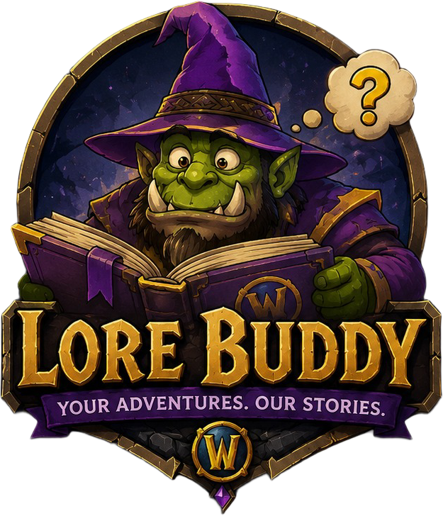

# LoreBuddy

<!-- markdownlint-disable MD033 -->
<p align="center">
  
</p>
<!-- markdownlint-restore -->

> *Your Adventures. Our Stories.*

LoreBuddy is an open-source, offline-first lore companion for World of
Warcraft. It helps players understand the characters, places, factions, items,
quests, and events around them without turning every moment into an
encyclopedia entry.

## What It Does

LoreBuddy is designed to provide contextual lore at the player's pace:

- Finds lore about nearby zones, NPCs, quests, events, and other entities.
- Supports quick, story, and deep detail levels.
- Respects discovery history and hides gated spoilers by default.
- Distinguishes confirmed facts from interpretations, theories, and speculation.
- Preserves source provenance, authority, attribution, and licensing details.
- Works with packaged local data without requiring an internet connection.
- Keeps optional Blizzard API enrichment and AI explanations outside the core
  addon boundary.

The initial addon target is Burning Crusade Classic Anniversary. The project is
currently in early development, and the TBC client interface value must still
be verified in an installed game client before a public release.

## Development Quick Start

Clone the repository, then validate the example lore dataset before making data
or schema changes:

```sh
./LoreBuddy validate
```

Build the installable addon layout for local testing with:

```sh
./tools/package_tbc_addon.sh
```

The generated `build/LoreBuddy/` directory contains the addon TOC plus the
packaged `Core/` and `Addon/` Lua files. See the project documents below for
the data model, source rules, compatibility evidence, and optional Blizzard
API setup.

Author and edit lore entries with the GUI authoring tool:

```sh
./LoreBuddy author
```

It opens a searchable entity list plus a detail editor for type, canon status,
quick/story/deep text, connections, and sources, and validates the dataset on
every save.

Before coding, read [Project Philosophy](docs/PROJECT_PHILOSOPHY.md). For
optional Blizzard API setup, see [Blizzard API Setup](docs/BLIZZARD_API_SETUP.md).
The current data contract is documented in [Data Model](docs/DATA_MODEL.md).
Source provenance and authority classifications are documented in
[Source System](docs/SOURCE_SYSTEM.md).
The offline query modules are described in [Lore Engine](docs/LORE_ENGINE.md).
Run `./LoreBuddy validate` to check the database before adding or packaging
content.
The initial addon target is documented in [TBC Anniversary Compatibility](docs/TBC_ANNIVERSARY_COMPATIBILITY.md).
CurseForge-ready copy is maintained in [CurseForge Description](docs/CURSEFORGE_DESCRIPTION.md).

<!-- markdownlint-disable MD033 -->
<p align="center">
  
</p>
<!-- markdownlint-restore -->

## License

The LoreBuddy software is licensed under the MIT License. See [LICENSE](LICENSE).

The MIT License applies to the software in this repository only. It does not
grant rights to World of Warcraft or other third-party lore, trademarks,
artwork, or source content. Third-party content and source attributions remain
subject to their respective owners' terms and licenses.
