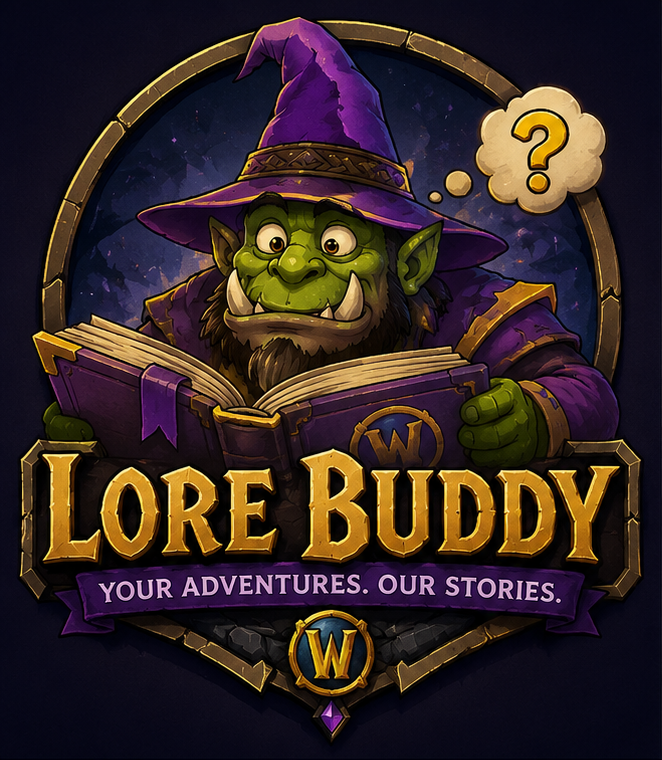

  

# LoreBuddy

> *Your Adventures. Our Stories.*

An open-source contextual lore companion for World of Warcraft and beyond.

Before coding, read [Project Philosophy](docs/PROJECT_PHILOSOPHY.md). For
optional Blizzard API setup, see [Blizzard API Setup](docs/BLIZZARD_API_SETUP.md).
The current data contract is documented in [Data Model](docs/DATA_MODEL.md).
Source provenance and authority classifications are documented in
[Source System](docs/SOURCE_SYSTEM.md).
The offline query modules are described in [Lore Engine](docs/LORE_ENGINE.md).
Run `./LoreBuddy validate` to check the database before adding or packaging
content.
The initial addon target is documented in [TBC Anniversary Compatibility](docs/TBC_ANNIVERSARY_COMPATIBILITY.md).

## License

The LoreBuddy software is licensed under the MIT License. See [LICENSE](LICENSE).

The MIT License applies to the software in this repository only. It does not
grant rights to World of Warcraft or other third-party lore, trademarks,
artwork, or source content. Third-party content and source attributions remain
subject to their respective owners' terms and licenses.
